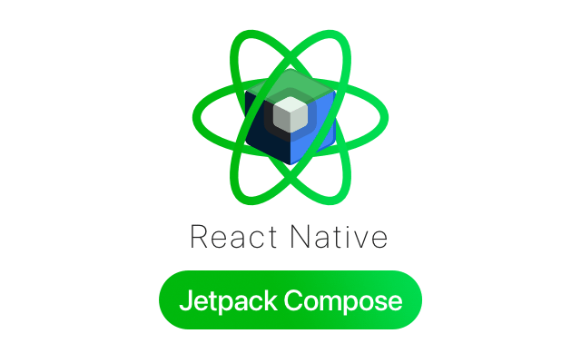
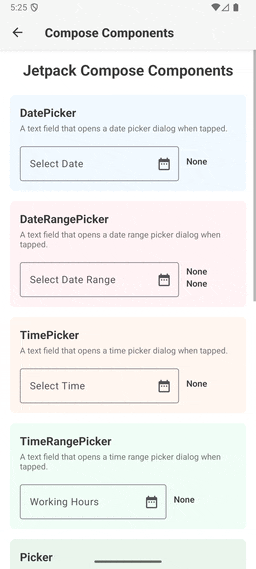

<!-- markdownlint-disable MD033 -->
<p align="center">
  <a href="https://mgcrea.github.io/react-native-jetpack-compose">
    
  </a>
</p>
<p align="center">
  <a href="https://www.npmjs.com/package/@mgcrea/react-native-jetpack-compose">
    
  </a>
  <a href="https://www.npmjs.com/package/@mgcrea/react-native-jetpack-compose">
    
  </a>
  <a href="https://www.npmjs.com/package/@mgcrea/react-native-jetpack-compose">
    
  </a>
  <a href="https://www.npmjs.com/package/@mgcrea/react-native-jetpack-compose">
    
  </a>
  <br />
  <a href="https://github.com/mgcrea/react-native-jetpack-compose/actions/workflows/main.yaml">
    
  </a>
  <a href="https://depfu.com/github/mgcrea/react-native-jetpack-compose">
    
  </a>
</p>
<!-- markdownlint-enable MD033 -->

## Overview

Native Jetpack Compose components for React Native using the Fabric renderer. Build Android forms and interfaces with Material 3 design while maintaining a familiar React workflow.

## Features

- **🤖 Native Jetpack Compose** - Real Material 3 components, not web views or custom drawings
- **🔧 No Dependencies** - Safe from supply chain attacks
- **⚡ Fabric Renderer** - Built on React Native's modern architecture
- **📝 TypeScript-first** - Full type safety and autocomplete support
- **🔄 Two-Way Binding** - State syncs between JavaScript and Compose
- **📋 Form Components** - TextField, Picker, SheetPicker, DatePicker, TimePicker
- **🎨 Material You** - Dynamic colors on Android 12+ with system theming
- **📱 Wide Compatibility** - Supports Android 7+ (API level 24)
- **📦 Zero Config** - No complex setup, just install and use

> **Note:** This library is Android-only. For iOS, check out [@mgcrea/react-native-swiftui](https://github.com/mgcrea/react-native-swiftui).

## Demo



## Quick Start

### Installation

```bash
npm install @mgcrea/react-native-jetpack-compose
# or
pnpm add @mgcrea/react-native-jetpack-compose
# or
yarn add @mgcrea/react-native-jetpack-compose
```

### Requirements

- React Native 0.76.0+ (New Architecture required)
- Android API level 24+ (Android 7.0)

### Basic Usage

```tsx
import { useState } from "react";
import { View } from "react-native";
import { TextField, DatePicker, Picker } from "@mgcrea/react-native-jetpack-compose";

export function BookingForm() {
  const [name, setName] = useState("");
  const [date, setDate] = useState<Date | null>(null);
  const [room, setRoom] = useState<string | null>(null);

  return (
    <View style={{ flex: 1, padding: 16, gap: 16 }}>
      <TextField
        label="Guest Name"
        value={name}
        onChange={setName}
      />
      <DatePicker
        label="Check-in Date"
        value={date}
        onConfirm={setDate}
      />
      <Picker
        label="Room Type"
        value={room}
        onChange={setRoom}
        options={[
          { value: "standard", label: "Standard Room" },
          { value: "deluxe", label: "Deluxe Suite" },
          { value: "penthouse", label: "Penthouse" },
        ]}
      />
    </View>
  );
}
```

## How It Works

Components are rendered directly through Jetpack Compose:

1. **React renders JSX** - Components receive props and manage state
2. **Props bridge to native** - Fabric passes props to Kotlin ViewManagers
3. **Compose renders UI** - Native Jetpack Compose renders Material 3 components
4. **Events bridge back** - User interactions trigger React callbacks

This means 60fps native performance with no JavaScript layout overhead.

## Documentation

📚 **[Full Documentation](https://mgcrea.github.io/react-native-jetpack-compose/)**

- **[Getting Started](https://mgcrea.github.io/react-native-jetpack-compose/getting-started/installation/)** - Installation and setup
- **[Components](https://mgcrea.github.io/react-native-jetpack-compose/components/)** - All available components
- **[Guides](https://mgcrea.github.io/react-native-jetpack-compose/guides/building-forms/)** - Forms, styling, and events
- **[Examples](https://mgcrea.github.io/react-native-jetpack-compose/examples/contact-form/)** - Complete working examples

## Contributing

Contributions are welcome! To run the example project:

```bash
git clone https://github.com/mgcrea/react-native-jetpack-compose.git
cd react-native-jetpack-compose
pnpm install

cd example
pnpm install
pnpm run android
```

## Credits

- [Jetpack Compose](https://developer.android.com/jetpack/compose) - Android's modern UI toolkit
- [React Native](https://reactnative.dev/) - Build native apps using React

## Authors

- [Olivier Louvignes](https://github.com/mgcrea) - [@mgcrea](https://twitter.com/mgcrea)

```text
MIT License

Copyright (c) 2025 Olivier Louvignes <olivier@mgcrea.io>

Permission is hereby granted, free of charge, to any person obtaining a copy
of this software and associated documentation files (the "Software"), to deal
in the Software without restriction, including without limitation the rights
to use, copy, modify, merge, publish, distribute, sublicense, and/or sell
copies of the Software, and to permit persons to whom the Software is
furnished to do so, subject to the following conditions:

The above copyright notice and this permission notice shall be included in all
copies or substantial portions of the Software.

THE SOFTWARE IS PROVIDED "AS IS", WITHOUT WARRANTY OF ANY KIND, EXPRESS OR
IMPLIED, INCLUDING BUT NOT LIMITED TO THE WARRANTIES OF MERCHANTABILITY,
FITNESS FOR A PARTICULAR PURPOSE AND NONINFRINGEMENT. IN NO EVENT SHALL THE
AUTHORS OR COPYRIGHT HOLDERS BE LIABLE FOR ANY CLAIM, DAMAGES OR OTHER
LIABILITY, WHETHER IN AN ACTION OF CONTRACT, TORT OR OTHERWISE, ARISING FROM,
OUT OF OR IN CONNECTION WITH THE SOFTWARE OR THE USE OR OTHER DEALINGS IN THE
SOFTWARE.
```
